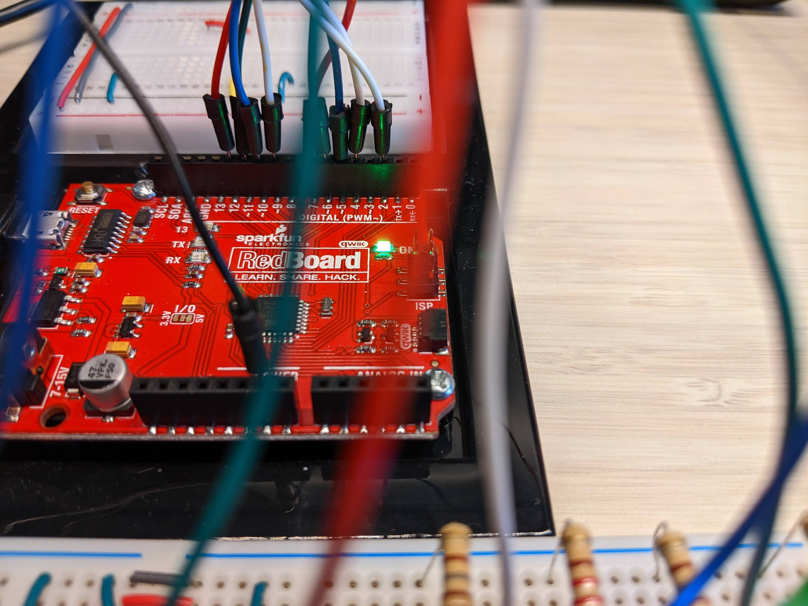

# Simon-Says game using Arduino

## Introduction

This project aims to build a game of 'Simon Says' using the Arduino board. The motivation for this project comes from following along with the guide that comes with the [SparkFun Inventor's Kit](https://www.sparkfun.com/products/15267).

## Table of Contents

1. [How is the game played?](#how-is-the-game-played)
2. [Setup](#setup)
    * [Demo](#demo)
    * [Schematic](#schematic)
    * [Components Used](#components-used)
    * [Program Logic](#program-logic)
3. [Things to keep in mind](#things-to-keep-in-mind)
3. [References](#references)

## How is the game played?

While there are many different versions of how you can play this game, this particular version of the game has a simple objective - Follow the exact sequence of the LEDs lighting up, in each round, using the push buttons to win the game. You lose if you push the wrong button or run out of time.

## Setup

### Demo

To view a video demo of this circuit, visit [Video Demo](https://drive.google.com/file/d/1z3C8AFlksbkfeasl9g1vy_1oI01oaFdi/view?usp=sharing).

### Schematic

### Components Used

|No.| Component Name | Description|Quantity|
|---|---             |---         |---     |
|1  |Push Button     |Momentary(default open) | 4 (Colors Red, Green, Blue, Yellow|
|2  |LEDs            |2-2.4v (20mA)| 4 (Colors Red, Green, Blue, Yellow|
|3  |Potentiometer   |10k ohms     | 1|
|4  |Peizo Buzzer    | -| 1|
|5  |Resistor        | 180 ohms | 3|
|6  |Resistor        | 220 ohms | 1|
|7  |Arduino Uno     | -| 1|
|8  |Connecting Wires|-| As many as needed|

**Note**: The 220 ohms resistor was chosen specifically for the blue LED since the blue LED I used was rated for 3-3.4 volts whereas other color LEDs were rated for 2-2.4 volts. To have uniform brightness amongst all LEDs the blue LED was connected via a higher resistance.
  

### Program Logic

**Note**: To understand the flowchart symbols used in the flowchart below, refer to [this](https://www.programiz.com/article/flowchart-programming).  

## Things to keep in mind

**Mind your variable data types!**  
Keep in mind the range of the data type you use, especially when it comes to declaring variables that store numerical values that can take on really large values. In the code for this project, a lot of time was spent debugging the time out feature of the circuit. A `startTime` variable was used to store the value returned by the [millis()](https://www.arduino.cc/reference/en/language/functions/time/millis/) function which simply returns the time(in milliseconds) passed *since* the Arduino board was connected to a power source. As a result of the size of the numerical value returned by the millis() function the `startTime` variable needs to store really large values that will overflow the `int` data type (See [Arduino int](https://www.arduino.cc/reference/en/language/variables/data-types/int/)). It is necessary & typical to use the [unsigned long](https://www.arduino.cc/reference/en/language/variables/data-types/unsignedlong/) data type to store the value returned by the millis() function.  

FYI, the millis() function will return the total time in milliseconds for upto 50 days.  
  
**Player Input**  
While the electronic circuit is not complicated, the code is what takes the most time. Specifically, the block of code that takes in player input from the push buttons. It needs a step by step approach to get it right. Break the player input task into sub tasks, implement one sub-task, upload to the board, run & see what works & what needs to be done next, and then go back to updating the code. The flowchart I have in the working directory for this project might be particularly useful.

## References

- "SparkFun Inventor's Kit, Version 4.1a", [Guide](https://learn.sparkfun.com/tutorials/sparkfun-inventors-kit-experiment-guide---v41)
- [SIKcode GitHub repo](https://github.com/sparkfun/SIK-Guide-Code)
- [Arduino Official Documentation](https://docs.arduino.cc/)
- [Design Programming Flowcharts](https://www.programiz.com/article/flowchart-programming)
